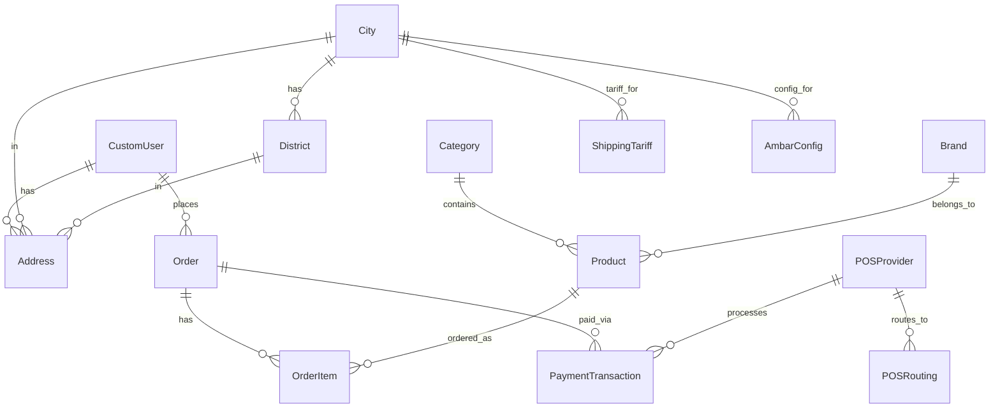

<div align="center">

# 🏗️ Yalıtım Deposu — B2B Yalıtım Malzemeleri Platformu

**Türkiye'nin Dijital Toptancısı**

Nalbur, usta ve müteahhitler için adet, palet ve tır bazlı toptan fiyatlarla yalıtım malzemeleri e-ticaret platformu.

[](https://python.org)
[](https://djangoproject.com)
[](https://www.django-rest-framework.org/)
[](LICENSE)

</div>

---

## 📋 İçindekiler

- [Proje Hakkında](#-proje-hakkında)
- [Temel Özellikler](#-temel-özellikler)
- [İş Kuralları & Fiyatlandırma](#-iş-kuralları--fiyatlandırma)
- [Teknoloji Yığını](#-teknoloji-yığını)
- [Proje Mimarisi](#-proje-mimarisi)
- [Veritabanı Modelleri](#-veritabanı-modelleri)
- [URL Yapısı & Endpoint'ler](#-url-yapısı--endpointler)
- [Kurulum & Çalıştırma](#-kurulum--çalıştırma)
- [Seed Data (Örnek Veri)](#-seed-data-örnek-veri)
- [Admin Paneli](#-admin-paneli)
- [Yol Haritası](#-yol-haritası)
- [Katkıda Bulunma](#-katkıda-bulunma)
- [Lisans](#-lisans)

---

## 🎯 Proje Hakkında

**Yalıtım Deposu (yalitimdeposu.com)**, Türkiye genelinde 81 ile teslimat yapan, B2B odaklı bir yalıtım malzemeleri e-ticaret platformudur. Platform, nalburcular, ustalar ve müteahhitlere hitap ederek üç farklı satış kademesinde (adet, palet, tır) uygun fiyatlarla yalıtım malzemeleri sunar.

### Ne Yapar?

- 🏪 **Dijital Toptancılık**: Fabrikadan son kullanıcıya kadar tedarik zincirini dijitalleştirir
- 📦 **Çoklu Satış Modları**: Adet bazlı perakende, palet bazlı yarı toptan ve tır bazlı tam toptan satış
- 🚚 **81 İle Teslimat**: Türkiye'nin tüm illerine anlaşmalı lojistik ağı ile teslimat
- 💳 **Akıllı Ödeme Yönlendirme**: Adet siparişleri şirket POS'undan, toptan siparişler fabrika POS'undan tahsil
- ⭐ **Plus Sadakat Programı**: Tek seferde 10.000 TL+ harcama yapan müşterilere 1 ay boyunca %3 indirim

### Ne Vaad Eder?

| Vaat | Açıklama |
|------|----------|
| **Fabrika Çıkış Fiyatları** | Toptan alımlarda aracısız, fabrika çıkış fiyatları |
| **Orijinal Ürün Garantisi** | Yetkili distribütör olarak %100 orijinal ürün |
| **Güvenli Ödeme** | 256-bit SSL şifreleme ile güvenli alışveriş |
| **Şeffaf Fiyatlandırma** | KDV ve nakliye durumu her satış modunda açıkça belirtilir |
| **Tüm Türkiye'ye Teslimat** | 81 ile anlaşmalı lojistik ağı ile teslimat |

---

## ✨ Temel Özellikler

### 🛒 Storefront (Vitrin)
- **Ana Sayfa**: Hero bölümü, güven şeridi, öne çıkan ürünler
- **Ürün Listeleme**: Kategori, marka ve arama ile filtreleme
- **Ürün Detay**: Çoklu fiyat kademeleri, teknik özellikler, dinamik fiyat hesaplama (AJAX)
- **Sepet**: Session bazlı sepet yönetimi, misafir ve üye desteği
- **Kategori Navigasyonu**: 8 ana kategori ile kolay gezinme

### 👤 Hesap Yönetimi
- **Üye Kayıt**: Firma adı, vergi no, telefon bilgileri
- **Giriş / Çıkış**: Django auth sistemi
- **Kullanıcı Paneli**: Adres yönetimi, sipariş geçmişi
- **Çoklu Adres**: İşyeri, ev, şantiye gibi farklı teslimat adresleri

### 📍 Lokasyon & Lojistik
- **Teslimat Bölgesi Seçimi**: İlk ziyarette şehir/ilçe seçimi (popup)
- **Dinamik Nakliye Hesabı**: Bölge ve ağırlık bazlı nakliye tarifeleri
- **Ambar Ücreti**: Depolama maliyetleri hesaplaması
- **81 İl Veritabanı**: Tüm il ve büyük illerin ilçe verileri

### 💰 Fiyatlandırma Motoru
- **Üç Kademe**: Adet, Palet, Tır bazlı ayrı fiyatlandırma
- **Plus İndirim**: Otomatik %3 indirim uygulaması
- **KDV Hesabı**: Mod bazlı KDV dahil/hariç gösterim
- **Hacimsel Ağırlık**: Desi hesabı ile nakliye optimizasyonu

### 💳 Ödeme Sistemi
- **Çoklu POS**: Şirket POS ve Fabrika POS desteği
- **POS Yönlendirme**: Admin tarafından dönemsel fabrika POS değişikliği
- **Taksit Desteği**: 2-12 taksit, oran bazlı komisyon hesabı
- **İşlem Takibi**: Ödeme logları ve durum yönetimi

---

## 📐 İş Kuralları & Fiyatlandırma

### Satış Modları ve Fiyat Kuralları

```
┌──────────┬───────────────┬──────────────┬──────────────────┬───────────────────┐
│ Mod      │ KDV           │ Nakliye      │ Görünürlük       │ Ödeme POS         │
├──────────┼───────────────┼──────────────┼──────────────────┼───────────────────┤
│ ADET     │ ✅ Dahil       │ ✅ Dahil      │ Herkes (misafir) │ Şirket POS        │
│ PALET    │ ❌ Hariç       │ ❌ Hariç      │ Sadece üyeler    │ Fabrika POS       │
│ TIR      │ ❌ Hariç       │ ❌ Hariç      │ Sadece üyeler    │ Fabrika POS       │
└──────────┴───────────────┴──────────────┴──────────────────┴───────────────────┘
```

### Plus Sadakat Programı

| Kural | Değer |
|-------|-------|
| **Aktivasyon Eşiği** | Tek seferde 10.000 TL+ sipariş |
| **Süre** | 30 gün |
| **İndirim** | Tüm ürünlerde %3 |
| **Geçerlilik** | Tüm satış modlarında |

### Sipariş Kuralları

- **Adet Siparişi**: Her ürünün minimum adet sipariş miktarı vardır (ör: min. 5 adet)
- **Palet Siparişi**: Palet katları halinde sipariş verilir (ör: 1 palet = 60 adet → 60, 120, 180...)
- **Tır Siparişi**: Tır katları halinde sipariş verilir (ör: 1 tır = 1200 adet)
- **Misafir Kullanıcı**: Sadece adet bazlı sipariş verebilir
- **Palet/Tır fiyatı boşsa**: O mod o ürün için devre dışıdır

### Nakliye Hesaplama

```
Ücretlendirilebilir Ağırlık = max(Gerçek Ağırlık, Hacimsel Ağırlık)
Hacimsel Ağırlık (desi)     = (Genişlik × Yükseklik × Derinlik) / 3000
Nakliye Ücreti              = Ücretlendirilebilir Ağırlık × Bölge Tarifesi
```

### Bölge Bazlı Nakliye Tarifeleri

| Bölge | kg Başına Ücret | Minimum Ücret |
|-------|-----------------|---------------|
| Marmara | 3 TL | 50 TL |
| Ege | 5 TL | 50 TL |
| Akdeniz | 6 TL | 50 TL |
| İç Anadolu | 8 TL | 50 TL |
| Karadeniz | 10 TL | 50 TL |
| Güneydoğu Anadolu | 12 TL | 50 TL |
| Doğu Anadolu | 14 TL | 50 TL |

### POS Yönlendirme Kuralları

- **ADET Siparişleri** → Her zaman **şirket POS'u** (12 taksit, belirli taksitlerde komisyon)
- **PALET / TIR Siparişleri** → Admin'in seçtiği **fabrika POS'u** (tek çekim)
- Admin, haftalık/dönemsel olarak aktif fabrika POS'unu değiştirebilir

---

## 🛠️ Teknoloji Yığını

| Katman | Teknoloji | Versiyon |
|--------|-----------|----------|
| **Backend** | Django | 4.2+ |
| **API** | Django REST Framework | 3.14+ |
| **Veritabanı** | SQLite (geliştirme) | 3 |
| **Frontend** | HTML5 + Vanilla CSS + JavaScript | - |
| **Form Stillemesi** | django-crispy-forms + Bootstrap 5 | 2.0+ |
| **CORS** | django-cors-headers | 4.0+ |
| **Görsel İşleme** | Pillow | 9.0+ |
| **Excel İmport** | openpyxl | 3.1+ |
| **Dil / Saat Dilimi** | Türkçe / Europe/Istanbul | - |

---

## 🏗️ Proje Mimarisi

```
yalitimdeposu/
├── manage.py                    # Django yönetim komutu
├── requirements.txt             # Python bağımlılıkları
├── seed_data.py                 # Örnek veri yükleme scripti
├── db.sqlite3                   # SQLite veritabanı (git dışı)
│
├── yalitimdeposu/               # Django proje konfigürasyonu
│   ├── settings.py              # Ayarlar (DB, apps, middleware, DRF, Plus)
│   ├── urls.py                  # Ana URL yönlendirme
│   ├── wsgi.py                  # WSGI sunucu arayüzü
│   └── asgi.py                  # ASGI sunucu arayüzü
│
├── apps/                        # Django uygulamaları
│   ├── accounts/                # 👤 Kullanıcı yönetimi
│   │   ├── models.py            #   CustomUser, Address, Plus hesap
│   │   ├── views.py             #   Kayıt, giriş, panel, adres CRUD
│   │   └── urls.py              #   /hesap/... endpoint'leri
│   │
│   ├── products/                # 📦 Ürün kataloğu
│   │   ├── models.py            #   Category, Brand, Product (3 fiyat kademesi)
│   │   ├── views.py             #   Ana sayfa, liste, detay, fiyat API
│   │   ├── admin.py             #   Admin panel (fiyat yönetimi, stok)
│   │   └── urls.py              #   / , /urunler/ , /urun/<slug>/
│   │
│   ├── orders/                  # 🛒 Sipariş & sepet yönetimi
│   │   ├── models.py            #   Order, OrderItem (3 satış modu)
│   │   ├── views.py             #   Sepet CRUD, sipariş listesi
│   │   └── urls.py              #   /siparis/sepet/... , /siparis/siparislerim/
│   │
│   ├── logistics/               # 🚚 Lojistik & teslimat
│   │   ├── models.py            #   City, District, ShippingTariff, AmbarConfig
│   │   ├── views.py             #   Şehir seçimi, ilçe API
│   │   └── urls.py              #   /lokasyon/...
│   │
│   └── payments/                # 💳 Ödeme sistemi
│       └── models.py            #   POSProvider, POSRouting, PaymentTransaction
│
├── core/                        # 🧠 Çekirdek iş mantığı
│   ├── pricing.py               #   Fiyatlandırma motoru (KDV, nakliye, Plus indirim)
│   └── context_processors.py    #   Global template veriler (sepet, kategori, lokasyon)
│
├── api/                         # 🔌 REST API (genişlemeye hazır)
│   └── urls.py                  #   API endpoint tanımları
│
├── templates/                   # 🎨 HTML şablonları
│   ├── base.html                #   Ana template (header, footer, nav, toast)
│   ├── storefront/              #   Vitrin sayfaları
│   │   ├── home.html            #   Ana sayfa
│   │   ├── product_list.html    #   Ürün listeleme
│   │   ├── product_detail.html  #   Ürün detay
│   │   ├── cart.html            #   Sepet
│   │   └── order_list.html      #   Sipariş geçmişi
│   └── accounts/                #   Hesap sayfaları
│       ├── login.html           #   Giriş
│       ├── register.html        #   Kayıt
│       └── dashboard.html       #   Kullanıcı paneli
│
└── static/                      # 📁 Statik dosyalar
    ├── css/main.css             #   Ana stil dosyası
    ├── js/location.js           #   Lokasyon seçim JavaScript
    └── img/logo.png             #   Platform logosu
```

---

## 🗄️ Veritabanı Modelleri

### Entity-Relationship Diyagramı



### Model Detayları

| Model | Uygulama | Açıklama |
|-------|----------|----------|
| `CustomUser` | accounts | AbstractUser genişletmesi — telefon, firma, vergi no, Plus hesap |
| `Address` | accounts | Çoklu teslimat adresi (başlık, il, ilçe, varsayılan) |
| `Category` | products | 8 ana kategori (sıralama, ikon, slug) |
| `Brand` | products | Marka (logo, slug) |
| `Product` | products | 3 kademe fiyat, ağırlık/ebat, stok, kâr marjı |
| `Order` | orders | Sipariş (misafir + üye, 6 durum, toplam hesaplama) |
| `OrderItem` | orders | Sipariş kalemi (ürün, mod, miktar, birim fiyat, nakliye) |
| `City` | logistics | 81 il (plaka, bölge) |
| `District` | logistics | İlçe (il bağlantılı) |
| `ShippingTariff` | logistics | Nakliye tarifesi (bölge/şehir, kg/desi/sabit) |
| `AmbarConfig` | logistics | Ambar depolama ücreti yapılandırması |
| `POSProvider` | payments | Sanal POS sağlayıcı (şirket/fabrika, taksit) |
| `POSRouting` | payments | POS yönlendirme (adet→şirket, toptan→fabrika) |
| `PaymentTransaction` | payments | Ödeme işlem kaydı (tutar, durum, POS yanıtı) |

---

## 🔗 URL Yapısı & Endpoint'ler

### Vitrin Sayfaları

| URL | View | Açıklama |
|-----|------|----------|
| `/` | `home` | Ana sayfa (öne çıkan ürünler) |
| `/urunler/` | `product_list` | Ürün listeleme (filtreleme: `?category=`, `?brand=`, `?q=`) |
| `/urun/<slug>/` | `product_detail` | Ürün detay sayfası (`?mode=ADET\|PALET\|TIR`) |

### Sepet & Sipariş

| URL | Method | Açıklama |
|-----|--------|----------|
| `/siparis/sepet/` | GET | Sepet görüntüleme |
| `/siparis/sepet/ekle/<id>/` | POST | Sepete ürün ekleme |
| `/siparis/sepet/guncelle/<id>/` | POST | Sepet miktarı güncelleme |
| `/siparis/sepet/sil/<id>/` | POST | Sepetten ürün çıkarma |
| `/siparis/siparislerim/` | GET | Sipariş geçmişi (üye) |

### Hesap Yönetimi

| URL | Açıklama |
|-----|----------|
| `/hesap/giris/` | Kullanıcı girişi |
| `/hesap/kayit/` | Yeni üye kaydı |
| `/hesap/cikis/` | Çıkış |
| `/hesap/hesabim/` | Kullanıcı paneli |
| `/hesap/adres/ekle/` | Adres ekleme |
| `/hesap/adres/<id>/sil/` | Adres silme |

### Lokasyon API

| URL | Açıklama |
|-----|----------|
| `/lokasyon/sehir-sec/` | Teslimat şehri seçimi (POST, AJAX destekli) |
| `/lokasyon/ilceler/<city_id>/` | İlçe listesi (AJAX JSON) |

### Fiyat API

| URL | Açıklama |
|-----|----------|
| `/api/urun/<id>/fiyat/` | Dinamik fiyat hesaplama (`?mode=&quantity=`) |

### Admin Paneli

| URL | Açıklama |
|-----|----------|
| `/yonetim/` | Django admin paneli |

---

## 🚀 Kurulum & Çalıştırma

### Gereksinimler

- Python 3.10+
- pip (Python paket yöneticisi)

### 1. Projeyi Klonlayın

```bash
git clone https://github.com/ozturkmustafamail-beep/yal-t-mdeposu.git
cd yal-t-mdeposu
```

### 2. Sanal Ortam Oluşturun

```bash
python3 -m venv venv
source venv/bin/activate  # macOS/Linux
# venv\Scripts\activate   # Windows
```

### 3. Bağımlılıkları Yükleyin

```bash
pip install -r requirements.txt
```

### 4. Veritabanını Oluşturun

```bash
python manage.py migrate
```

### 5. Örnek Verileri Yükleyin

```bash
python seed_data.py
```

Bu script şunları yükler:
- 🏙️ 81 il ve büyük illerin ilçeleri
- 📁 8 ürün kategorisi
- 🏷️ 8 marka (Köster, İzocam, Hekim Yapı, Betek vb.)
- 📦 10 örnek ürün (3 kademe fiyatıyla)
- 🚚 7 bölgesel nakliye tarifesi + ambar yapılandırması
- 💳 3 POS sağlayıcı + yönlendirme kuralları

### 6. Admin Kullanıcısı Oluşturun

```bash
python manage.py createsuperuser
```

### 7. Sunucuyu Başlatın

```bash
python manage.py runserver
```

Tarayıcıda `http://127.0.0.1:8000` adresine giderek siteyi görebilirsiniz.

---

## 🌱 Seed Data (Örnek Veri)

`seed_data.py` scripti aşağıdaki örnek verileri içerir:

### Kategoriler
| # | Kategori | Slug |
|---|----------|------|
| 1 | Çatı Yalıtımı | `cati-yalitimi` |
| 2 | Dış Cephe Yalıtımı | `dis-cephe-yalitimi` |
| 3 | Zemin Yalıtımı | `zemin-yalitimi` |
| 4 | Isı Yalıtımı | `isi-yalitimi` |
| 5 | Su Yalıtımı | `su-yalitimi` |
| 6 | Ses Yalıtımı | `ses-yalitimi` |
| 7 | Boya ve Sıva | `boya-siva` |
| 8 | Yapıştırıcı ve Bant | `yapistirici-bant` |

### Örnek Ürünler

| Ürün | Adet Fiyatı | Palet Fiyatı | Tır Fiyatı | Palet Adet | Tır Adet |
|------|-------------|--------------|------------|------------|----------|
| Köster KBE Liquid Film | 3.000 ₺ | 2.100 ₺ | 1.800 ₺ | 30 | 720 |
| Köster 21 Bitüm Membran | 2.160 ₺ | 1.500 ₺ | 1.250 ₺ | 20 | 480 |
| İzocam Taş Yünü Panel 5cm | 420 ₺ | 290 ₺ | 240 ₺ | 40 | 800 |
| Hekim EPS Strafor Levha 3cm | 54 ₺ | 38 ₺ | 30 ₺ | 100 | 2.000 |
| Teknoyalıtım XPS Levha 4cm | 102 ₺ | 70 ₺ | 55 ₺ | 60 | 1.200 |
| Betek Elastik Dış Cephe Boyası | 1.440 ₺ | 1.000 ₺ | — | 24 | — |

> **Not**: Adet fiyatları KDV ve nakliye dahil; Palet/Tır fiyatları KDV ve nakliye hariçtir.

---

## 🔧 Admin Paneli

Django admin paneline `/yonetim/` adresinden erişebilirsiniz.

### Admin Özellikleri

- **Ürün Yönetimi**: Üç kademe fiyat, kâr marjları, stok takibi, toplu düzenleme
- **Kategori & Marka**: Slug otomatik oluşturma, sıralama, aktiflik
- **Sipariş Takibi**: 6 aşamalı sipariş durumu (Beklemede → Teslim Edildi)
- **Lojistik Tarifeleri**: Bölge/şehir bazlı nakliye ve ambar ücretleri
- **POS Yönetimi**: Aktif POS değişikliği, fabrika POS rotasyonu
- **Kullanıcı Yönetimi**: Plus hesap durumu, harcama takibi

---

## 🗺️ Yol Haritası

### v1.0 — Temel Platform ✅
- [x] Ürün kataloğu (3 kademe fiyat)
- [x] Sepet yönetimi (session bazlı)
- [x] Kullanıcı kayıt/giriş
- [x] Teslimat bölgesi seçimi
- [x] Fiyatlandırma motoru
- [x] Plus sadakat programı
- [x] Admin paneli
- [x] Seed data

### v1.1 — Ödeme & Sipariş Akışı 🔜
- [ ] Sanal POS entegrasyonu (Garanti BBVA / İyzico)
- [ ] Sipariş oluşturma akışı (checkout)
- [ ] Sipariş onay e-postası
- [ ] Fatura oluşturma

### v1.2 — Gelişmiş Özellikler
- [ ] Ürün görselleri yükleme
- [ ] Favori listesi
- [ ] Fiyat alarmı
- [ ] Excel ile toplu ürün ekleme (openpyxl)
- [ ] Karşılaştırma özelliği

### v2.0 — Mobil & API
- [ ] REST API tamamlama (DRF)
- [ ] Mobil uygulama (React Native / Flutter)
- [ ] Push notification
- [ ] Canlı destek entegrasyonu

### v3.0 — Marketplace
- [ ] Çoklu satıcı (multi-vendor) desteği
- [ ] Satıcı paneli
- [ ] Komisyon yönetimi
- [ ] Otomatik fatura/e-arşiv

---

## 🤝 Katkıda Bulunma

1. Bu depoyu fork edin
2. Feature branch oluşturun (`git checkout -b feature/yeni-ozellik`)
3. Değişikliklerinizi commit edin (`git commit -m 'Yeni özellik: ...'`)
4. Branch'inizi push edin (`git push origin feature/yeni-ozellik`)
5. Pull Request açın

### Geliştirme Kuralları

- Tüm model ve view docstring'leri **Türkçe** yazılmalıdır
- Yeni endpoint'ler Türkçe URL pattern'i kullanmalıdır (ör: `/siparisler/`, `/urunler/`)
- Her yeni model için admin kaydı oluşturulmalıdır
- Fiyat hesaplamaları `core/pricing.py` içinde merkezileştirilmelidir
- KDV oranı `%20` varsayılan olup ürün bazında değiştirilebilir

---

## 📄 Lisans

Bu proje özel lisanslıdır. Tüm hakları saklıdır.

© 2026 Yalıtım Deposu. İzinsiz kopyalanamaz ve dağıtılamaz.

---

<div align="center">

**Yalıtım Deposu** ile Türkiye'nin yalıtım sektörünü dijitalleştiriyoruz. 🏗️

[Web Sitesi](https://yalitimdeposu.com) · [İletişim](mailto:info@yalitimdeposu.com) · [Destek](tel:+902121234567)

</div>
